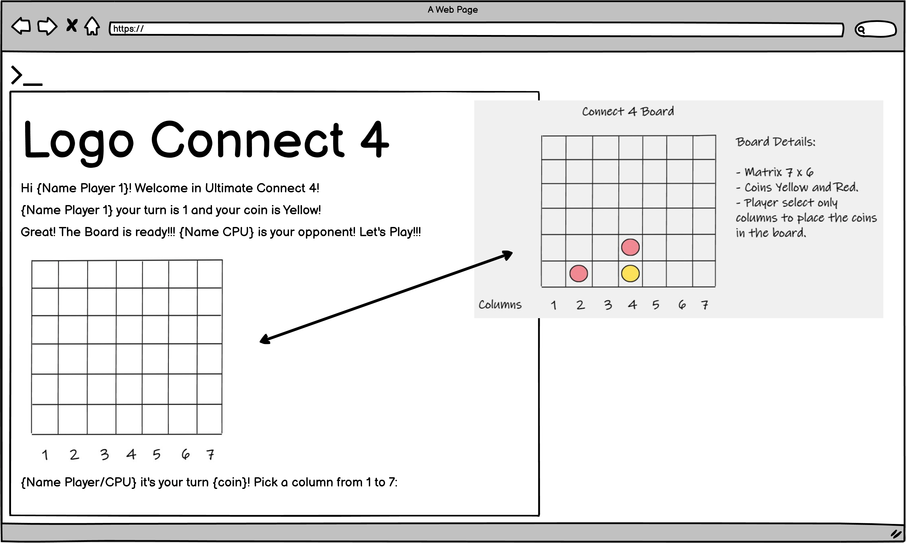
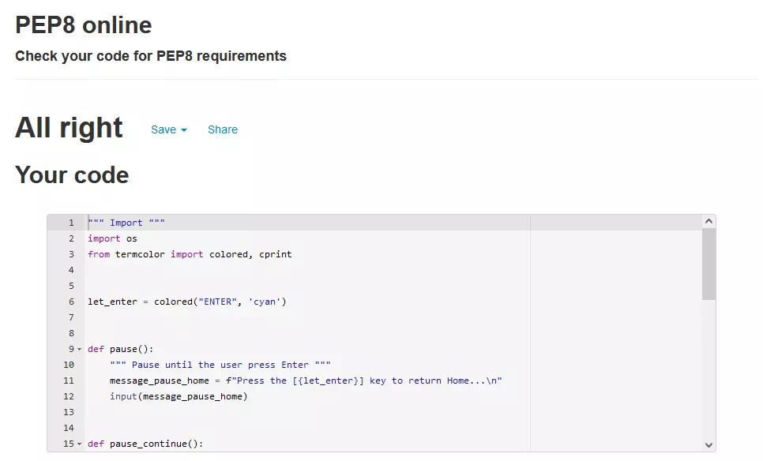

# **Connect 4** 

### **Developer: Claudio Crocilla**

## **Overview**

#### The application offers the possibility to play Connect 4! 
#### Connect 4 is a board game first invented in 1974, since then many players have tried to win by being the first to form a horizontal, vertical, or diagonal line of four of one's own tokens. Nowadays you can play online having the possibility of challenging a CPU when playing in single mode or friends in multiplayer mode.
#### The idea of this application is to provide a means to participate to a friendly competition, playing one of the most famous game in the world, Connect 4, granting the users a few relaxing but intense minutes to themselves.
#### The application is intuitive and user-friendly! The users can review the instructions and then play just entering their name and deciding if they want to play alone or with a friend! 
#### Good luck to everyone and enjoy this amazing Connect 4! 

#### Click in the image above to access the Live Application or [click here!](https://ultimateconnect-four.herokuapp.com/)

## **Project** 

### **User Goals**
- Easy, Intuitive and User-Friendly Application.
- Wide compatibility with every Browsers and Devices.
- Different Game Modes (Single or Multiplayer Mode).
- Single Player mode against the CPU to challenge themselves.
- Multiplayer Mode to play and have fun against friends.

---

## **User Experience (UX)**

### **User Stories**
- #### First Time Visitor Goals
	1. As a First Time visitor of an Application dedicated to Connect 4, I want to have a nice visual impact on the Main Menu Screen that will attract my attention.  
	2. As a First Time Visitor, I want to be able to read clear Instructions on how the game works.
	3. As a First Time Visitor, I want to be able to access the game and play against the CPU.
	4. As a first Time Visitor, I want to be able to access the game and play with friends. 
	4. As a First Time Visitor, I want to find the application pleasant to the eyes, visually intuitive, with catchy colours.

   
- #### Returning Visitor Goals/Frequent User Goals
	1. As a Returning Visitor/Frequent User, I want to be able to access the game and play against the CPU.
	2. As a Returning Visitor/Frequent User, I want to be able to play against a friend.
	3. As a Returning Visitor/Frequent User, I want to be challenged on different levels by the CPU with new difficulties (this will be implemented in the next future).

	
<!-- Use Cases Area -->
### **Use Cases**

### *_Connect 4 Application_*

    
Description

    
- Users can use this application to play Connect 4.
- Users should be able to read Instructions/Rules.
- Users should be able to start a new game.
- Users should be able to select the mode (Single or Multiplayer).
- Users should be able to enter their names.
- Users should be able to play the game.
- Users should receive a confirmation if they have won.

    
System & Actors

**System:** Connect 4 Application.

**Actors:** Users looking to play Connect 4.

    
Pre-Conditions

- User(s) should select if he/she wants to play against the CPU or a friend.
- User(s) should enter his/her name to be able to play.

    
Basic Flow

- The user browses for Connect 4 and discovers the application. The user navigates to the application of the website, and is attracted by the visual impact. 
- The user reads the instructions/rules. 
- The user selects which mode he/she wants to play.
- The user enters the name.
- The user starts a new game.
- The user wins/loses the game.
- The user can restart the game or exit the application. 

    
Alternative/Exception Flow

- If the user types a non-existent command, an Error will be prompted guiding the user to insert the right command.

---

<!-- Design Area -->
## **Design**

#### The Application has been designed to provide a simple, interactive, clear and effective experience enabling the user to play a strategy game with a friend (in multiplayer mode) or alone against a CPU (single player) for a few relaxing but yet exciting moments.

- ### **Colour Scheme**
#### To provide the user with a good and positive impact at a first glance, when opening the application and through the entire experience, the Termcolor Module has been used colouring different parts of the text (depending if the CPU is playing/thinking or if a message is printed) with key colours in the terminal. The Module was used to render the boarding game equal to the original Connect 4 Board. 
#### The list of colours is chosen to be pleasing to the eyes providing an excellent contrast in the terminal to allow the user to have prolonged gaming hours without tiring the eyes. 
- ### **Colours Features** 
#### The colour used for the Logos is Red.
#### In each question, the key letters that the user needs to press have been highlighted with a different colour for easy usage of the application. 
#### The blue colour has been used for the board in order to replicate a realistic Connect 4.
#### Each coin used by the user is an emoji. The colour of the coins are yellow and red as in the real Connect 4 game.

--- 

<!-- Features Area -->
## **Features**
- ### *__Structure__*:

#### The Connect 4 created is a text base game realized in python that runs in a terminal. 
#### It has been structured in a simple, easy and user-friendly way providing a great experience to the user looking to play Connect 4 alone or against a friend. 
#### Structure of the application and the components used are listed below:
#### The first part of the Project has been dedicated to the creation of the wireframes, flow-chart and some drawing sketches made on Microsoft Whiteboard. These sketches provide a visual aid to understand all the programming steps undertaken for the realization of the project and the rationale behind those. 
#### 

    
Click here to see the Flow-Chart
  

    
Click here to see the drawing sketches
  

Each part and component used is listed below:

- ### *__Main menu__*:
#### The game starts showing the Main Menu to the user.
#### This displays the logo of the Application on the top left of the terminal followed by a welcome message.
#### The logo shows the name of the game “Connect 4” with visual effects of flames. The logo was generated with ASCII Art using the website [Patorjk.com](https://patorjk.com/software/taag).
#### The Logo has been placed in a txt file, content of which was read and displayed in the terminal by using the “with statement” and the “open function” and then displaying the content using the print() function in Python. 
#### The Termcolor Module has been used for both Logo and Welcome message and the colour red was utilized for display.
#### Right after the Welcome Message there is an input function. 
#### This function displays a message presenting the players with the possibility to type “P” to start playing the game or “I” to read the instructions.
#### The “lower()” function has been integrated into the input to allow the user to type the required characters without having to mind the use of capitals vs lower letters. In this way, wherever the player types the letter, this will be always recognized by the software as uncapitalized.  
#### To provide a visual impact, the letters have been placed inside square brackets and highlighted using the Termcolor Module as can be seen in the image below: 

    
Click here to see the image!
  

#### If the player types an incorrect value an error message is prompted bringing the user back to the selection for a correct choice.
#### Those behaviours are consistent in all parts of the application.

- ### *__Instructions__*:
#### In the Main Menu, when typing “I”, the instructions/rules of the game can be accessed.
#### The Instruction area displays a logo (“Instructions”) on the top left of the terminal followed by the Instructions of the game. The logo and the message of this area mimic the display of the main page, they are represented in red for consistency, with flames arising from the logo (isn’t it hot to play this game?? 😁). 
#### As for the Main Menu the Instruction Logo and the Instructions have been placed in a txt files and displayed in the terminal using the “with” statement, the function “open” and the print() function. 
#### Once the Player is ready, he/she can press the Enter Key to go back to the Main Menu.
#### A clear() function was created to remove the content of the terminal once the Player presses the Enter Key, bringing the user back to the Main Menu. 
 

- ### *__Start Menu__*:
#### In the Main Menu, the user is able to access the Start Game Area by typing “P”. In this area the player can decide to play in Single or Multiplayer Mode (in the message displayed to the user the letters S and M have been highlighted). Once one of the options (S or M) is selected the Start Game will be prompted. 

- ### *__Start Game__*:
#### After the selection of the mode, the user will be asked to insert his/hers name.
#### This is saved in a List and it is used during the game. If the M (Multiplayer) is selected users can insert their name as player 1 and player 2.
#### Once the name is inserted, the terminal will show the user his/hers name associated with the player turn and an emoji (coin) either red or yellow.  
#### In Single Player Mode the user will play against a CPU called Roboto. 
#### Roboto represents an artificial intelligence (AI), defined in python with two functions used to investigate the board and the position of the placed coins horizontally and vertically placing the next move either to block the opponent or to attack when two coins of the same colours are adjacent.  
#### In Multiplayer Mode two humans will challenge each other.

#### The Players/Roboto can select the board desired position by indicating a number from 1 to 7 representing the columns (this is also displayed in a message printed into the board to provide a clear instructions to the players). Every time the Player/CPU makes a move, the coin is positioned at the lowest free space for that particular chosen column. This was designed in the code using a function that simulates the Gravity of the coins. For each new move a new board is rendered showing the placed coins. In addition, a message is displayed in the top section of the terminal summarising the move of the opponent (either from Roboto or the other human player). 
#### The game ends when one is able to place 4 consecutive coins either vertically, horizontally or diagonally.
#### Once the player/cpu wins a message will display the name of the winner, the board is rendered in order to see the winning combination and a message will be prompt to the user asking to either try a rematch (by typing R) or exit the game (by typing E).

#### If a rematch is selected the board is re-set and the game starts again with the same players’ configuration as per previous match.

---

## **Wireframe**

- ## Main Menu 

    
Click here for Main Menu View
  

- ## Instruction 

    
Click here for Instruction View
  

- ## Select Mode Single Player

    
Click here for Select Mode Single Player View
  

- ## Select Mode Multiplayer 

    
Click here for Select Mode Multiplayer View
  

- ## Start Single Player Mode

    
Click here for Start Single Player Mode View
  

- ## Start Multiplayer Mode

    
Click here for Start Multiplayer Mode View
  

- ## Gameplay

    
Click here for Gameplay View
  

- ## Winner Screen 

    
Click here for Winner Screen View
  

---

## **Technologies Used**

- ### **Languages**

#### The Languages used is:
 - Python

#### Only custom Python Code has been used.

- ### **Frameworks, Libraries & Programs Used** 

#### No Design Framework has been used.

- #### Random Module: 
    - #### Random is a built-in module used to make random numbers. It has been used for the CPU to generate random values to allow Roboto making moves if no adjacent coins are available (early stage of the game).

- #### Termcolor Module:
    - #### Termcolor has been used to colour the text in the terminal.
    
- #### Sys Module:
    - #### The sys module in Python provides various functions and variables that are used to manipulate different parts of the Python runtime environment. Sys was used for the exit function.
    
- #### Time Module:
    - #### This module provides various time-related functions. It has been used to set delayed time with the sleep() method. 
    
- #### Numpy  Module:
    - #### This module provides multidimensional array objects, as well as variations like matrices, which can be used for various math operations. It has been used to manage the matrix created for the Connect 4.
    
- #### Enum Module:
    - #### This module defines four enumeration classes that can be used to define unique sets of names and values. It has been used to define the genre (human or cpu player). 

- #### Intelligent Diagramming: 
    - #### Intelligent Diagramming has been used to create the flow-chart for the game.

- #### Microsoft Whiteboard:
     - #### This is an infinite, collaborative canvas for effective meetings and engaging learning. Whiteboard was used to summarise the programming steps and the rationale behind those. Whiteboard has been used together with the flow chart generated with Intelligent Diagramming. 

- #### Heroku: 
    - #### Heroku is a platform as a service (PaaS) and it has been used to run the Connect 4 application entirely on the cloud.

---

## **Testing**
The testing phases have been carried out using the **PIP8 Python Validator**. No errors have been identified from the Validators as can be seen in the screenshots below: 

- **Python**

    
Click here for **PIP8 Python Validator** in file run.py 

    
Click here for **PIP8 Python Validator** in file ai.py 

    
Click here for **PIP8 Python Validator** in file utilities.py 

    
Click here for **PIP8 Python Validator** in file gameover.py 

    
Click here for **PIP8 Python Validator** in file player.py 

- ### **Test Cases**

List of Test Cases performed. These Tests were executed for all available Devices listed in the section below including also Layout testing. 

| Page | Feature | Expected Result | Status | 
| --- | --- | --- | --- |
| Terminal | Main Menu | Make sure that the Logo is displayed in the Terminal. | Pass |
| Terminal | Main Menu | Make sure that the colour of the Logo is red. | Pass |
| Terminal | Main Menu | Make sure that the Play or Instructions selection message is displayed and that the letters are highlighted.| Pass |
| Terminal | Main Menu | Make sure that typing “i” and then pressing the Enter Key the player accesses the Instructions. | Pass |
| Terminal | Instructions | Make sure that the instructions are displayed. | Pass |
| Terminal | Instructions | Make sure that pressing the Enter Key the user is redirected back to the Main Menu. | Pass |
| Terminal | Main Menu | Make sure that typing “p” and then pressing the Enter Key the player accesses the Start Menu.  | Pass |
| Terminal | Start Menu | Make sure that the Logo is displayed in the Terminal. | Pass |
| Terminal | Start Menu | Make sure that the Single or Multiplayer selection message is displayed and that the letters are highlighted.| Pass |
| Terminal | Main Menu | Make sure that typing “s” and then pressing the Enter Key the player accesses the Single Player Mode.  | Pass |
| Terminal | Main Menu | Make sure that typing “m” and then pressing the Enter Key the player accesses the Multiplayer Mode.  | Pass |
| Terminal | Start Game | Make sure that in Single Player Mode only the name of Player 1 is requested. | Pass |
| Terminal | Start Game | Make sure that the user can enter the name and press the Enter Key to start the game. | Pass |
| Terminal | Start Game | Make sure that in Multiplayer Mode both names of Player 1 and 2 are requested. | Pass |
| Terminal | Start Game | Make sure that both users can enter their names and press the Enter Key to start the game. | Pass |
| Terminal | Single Player Mode | Make sure that a message to the user is displayed showing the turn and coin colour associated. | Pass |
| Terminal | Single Player Mode | Make sure that the board is rendered correctly. | Pass |
| Terminal | Single Player Mode | Make sure that a message prints the available selection (column numbers) to the user. | Pass |
| Terminal | Single Player Mode | Make sure that entering the correct column number the coin is printed in the column board selected. | Pass |
| Terminal | Single Player Mode | Make sure that if entering an incorrect column number a clear error message is displayed to guide the user to select the correct value. | Pass |
| Terminal | Single Player Mode | Make sure that after the first move the next turn is managed by the CPU. | Pass |
| Terminal | Single Player Mode | Make sure that at the end of each move a message is displayed showing the move made by the previous user (Player or CPU)| Pass |
| Terminal | Single Player Mode | Make sure that at the end of each move the terminal is cleared and a new one is generated with the coin entered by the user(s) | Pass |
| Terminal | Multiplayer Mode | Make sure that a message to the user is displayed showing the turn and coin colour associated. | Pass |
| Terminal | Multiplayer Mode | Make sure that the board is rendered correctly. | Pass |
| Terminal | Multiplayer Mode | Make sure that a message prints the available selection (column numbers) to the user. | Pass |
| Terminal | Multiplayer Mode | Make sure that entering the correct column number the coin is printed in the column board selected | Pass |
| Terminal | Multiplayer Mode | Make sure that if entering an incorrect column number a clear error message is displayed to guide the user to select the correct value. | Pass |
| Terminal | Multiplayer Mode | Make sure that after the first move the next move/turn is managed by the second player. | Pass |
| Terminal | Multiplayer Mode | Make sure that at the end of each move a message is displayed showing the move made by the previous user. | Pass |
| Terminal | Multiplayer Mode | Make sure that at the end of each move the terminal is cleared and a new one is generated with the coin entered by the user(s) | Pass |
| Terminal | All Modes | Make sure once the game is won, the terminal is cleared and the board is rendered. | Pass |
| Terminal | All Modes | Make sure that once the game is won, a message is displayed with the name of the winner. | Pass |
| Terminal | All Modes | Make sure that once the game is won, a message is prompted to the user asking to restart or exit the game. | Pass |
| Terminal | All Modes | Make sure that if a player types “e” the game is closed.  | Pass |
| Terminal | All Modes | Make sure that if a player types “r” the game restarts using the same players’ configuration of the previous game.  | Pass |
| Terminal | All Modes | Make sure that when restarting the game a new empty board is rendered.  | Pass |
| Terminal | All Modes | Make sure that if all columns are full a Game Over message appears and the user is able to restart or exit the game.  | Pass |

### **Additional Tests**
Tests have been performed on Firefox, Microsoft Edge, Chrome and Safari and the result is consistent in all browsers. 

### **Bugs**
Observed Results:
- Please note that in Firefox, the emoji (coins) are cut-off as can be seen in the image below. 

    
Click here to see the Firefox Coin Cut-Off Bug 

The developer has fully investigated and researched the issue through the web, including the installation of buildpacks in Heroku, however the rendering of the emoji (the coins) was still defective with no successful solutions found. 

### **Future Implementation**
- Give to the user the possibility to select the difficulty of the CPU when playing in Single Player Mode.
- Give the user the possibility to decide who will start first (Player 1 or 2).
- Give to the user the possibility to pick the colour of the coin (Red or Yellow).
- Creation of a Leader board to save and display users’ score.
- Implementation of images and graphics to mimic  the real Connect 4 and to solve the emoji issue reported above for an improved visual impact. 

---

## **Development** 
### Deployment

- ### **Github**
The repository for the project Ultimate Connect 4 has been created using Github using the following procedures:
1. Create a Github Account [Github.com](https://github.com/)
2. In the top left Github Home Screen click on the green New Button in order to create a new repository
3. Select the Template if available (Example: Code-Institute-Org/python-essentials-template)
4. Choose the Repository name
5. Click on the Create Repository Button in order to create the repository
6. Install the Gitpod Extension in your browser
7. Once Gitpod Extension has been installed, accessing the repository previously created, click on the Gitpod Button
8. A new page will be opened and the Workspace will be created
   

- ### **Heroku App**
Heroku is a platform as a service (PaaS) used to run, operate the Connect 4 application entirely in the cloud using the following procedures:
1.	Create an Heroku Account [Heroku.com](https://www.heroku.com/)
2.	In the top right of the “Welcome to Heroku” Screen click on the New drop-down menu
3.	Click on the Create “New App Button”
4.	Select an App Name (Example: Connect-four)
5.	Choose the region: “Europe”
6.	Click on the Create App Button
7.	Go in the Settings Tab
8.	In the Config Vars section click on the Reveal Config Vars Button
9.	Enter “PORT” in the Key field, “8000” in the Value field and then press Add
10.	Go in the Buildpacks section and click on the Add Buildpack Button
11.	Select python and press Save Changes
12.	Click again on the Add Buildpack Button and then click on node.js and Save Changes
13.	Ensure that the order of the buildpacks is as follow: 1. `heroku/python` and then 2. `heroku/nodejs`
14.	Go in the Deploy Tab 
15.	In the Deployment method section select Github to connect with your repository
16.	In the App connected to Github section type the name of the repository (Example: connect-four) and then press Add
17.	Go in the Manual section, select the correct branch and click on Deploy Branch
18.	Click on the View Button as soon as the deploy is finished and you will be redirected to a new page with your application. 

<!-- Forking Content from Code Institute Readme File Sample -->
- ### **Forking the GitHub Repository**  
By forking the GitHub Repository we make a copy of the original repository on our GitHub account to view and/or make changes without affecting the original repository by using the following steps:
1.	Log in to GitHub and locate the GitHub Repository
2.	At the top of the Repository (not top of page) just above the "Settings" Button on the menu, locate the "Fork" Button
3.	You should now have a copy of the original repository in your GitHub account

- ### **Local Clone**
By creating a Local Clone you will be able to create a copy of the repository that is available in your local computer.
In order to create a Local Clone follow the steps below: 
1.	Log in to GitHub and locate the GitHub Repository that you want to clone
2.	Click on the Code Button
3.	To clone the repository using HTTPS, under "Clone with HTTPS", copy the link
4.	Open Git Bash
5.	Change the current working directory to the location where you want the cloned directory to be made
6.	Type git clone as shown in the example below and then paste the URL copied in Step 3
>$ git clone https://github.com/YOUR-USERNAME/YOUR-REPOSITORY
7. Press Enter 
8. Your local clone will be created

---

## **Credits**

#### Thanks to my Mentor, Narender Singh, for his guide and support for the realization of this project.
#### Thanks to the useful references and suggestions derived from the sources listed below, I manage to gain a deeper understanding of how the various elements/components of Python are used. In addition, continuous trial and error tests provided a useful means to further experiment on the usage of python for the creation of the application. 

- ### **Content & Media**
All of the contents on the application are customised.
In order to consolidate the knowledge acquired during the Code Institute Course dedicated to Python language (as well as the HTML, CSS and Javascript), I have also used the websites listed below  studying and focussing on the writing coding procedures and its best practices: 
- [GeekforGeeks.org – General Knowledge](https://www.geeksforgeeks.org/python-programming-language/?ref=shm)
- [GeekforGeeks.org – Python Libraries](https://www.geeksforgeeks.org/libraries-in-python/)
- [Tutorialspoint.com](https://www.tutorialspoint.com/python/index.htm)
- [W3schools.com](https://www.w3schools.com/python/default.asp)
- [Python.org](https://www.python.org/)
- [Realpython.com](https://realpython.com/tutorials/best-practices/)
- [Thanks to Traversy Media for the video of Python cCrash Course for Beginners](https://www.youtube.com/watch?v=JJmcL1N2KQs)

Listed here the Source of the additional sources investigated  for Python and for the realization of the Connect 4 project: 
- Matrix
  - [Numpy.org](https://numpy.org/)
  - [Programiz.com](https://www.programiz.com/python-programming/matrix)
  - [GeekforGeeks.org](https://www.geeksforgeeks.org/take-matrix-input-from-user-in-python/)
- Termcolor
  - [Pypi.org](https://pypi.org/project/termcolor/)
- Clear Console
  - [Delftstack.com](https://www.delftstack.com/howto/python/python-clear-console/)
- With Statement
  - [Pythonforbeginners.com](https://www.pythonforbeginners.com/files/with-statement-in-python)
- Module vs Packages
  - [Data-flair.training](https://data-flair.training/blogs/python-modules-vs-packages/)
- Python File Open
  - [W3School.com](https://www.w3schools.com/python/python_file_handling.asp)
- Python Classes and Objects
  - [Delftstack.com](https://www.delftstack.com/howto/python/call-a-class-in-python/)
  - [W3School.com](https://www.w3schools.com/python/python_classes.asp)
- Python Try Except
  - [W3School.com](https://www.w3schools.com/python/python_try_except.asp)
- Python Classes and Objects
  - [W3School.com](https://www.w3schools.com/python/python_classes.asp)
- Enum Module
  - [Docs.python.org](https://docs.python.org/3/library/enum.html)
- ASCII Art
  - [Patorjk.com](https://patorjk.com/software/taag/#p=display&f=Fire%20Font-k&t=Connect%204)

The most complex part to develop for the Connect 4 application were the “Gravity” of  the Coin, the logic to apply to check for the winner, and the generation  of the functions that let the CPU have an AI. 
The following applications were inspirational and helped me understanding how to structure the logic on the gravity of the coin entered in the table. 
I have customized and created my own code taking inspiration from:
- [Thanks to Shaun Halverson for the video of How to Code Connect 4 in Python](https://www.youtube.com/watch?v=NkmYfTl2L_Y&t=576s)
- [Thanks to Spencer Lepine for the video of Python Connect 4 Tutorial](https://www.youtube.com/watch?v=gvP0gNSO17k&t=315s)

Thanks to Narender Singh, who, as always, directed me towards the right path by providing advices and suggestions that would allow me improve my performances in writing the code and “think like” a developer. 

Thanks to Kasia Bogucka and Narender Singh also for suggesting the use of github wiki site to create the Markdown file. They have also provided the link for the Sample Readme of Code Institute.
- [Sample Readme File - Code Institute](https://github.com/Code-Institute-Solutions/SampleREADME)
- [Markdown - Cheatsheet](https://github.com/adam-p/markdown-here/wiki/Markdown-Cheatsheet)

But most of all thanks to my girlfriend Rosi Davi who is always beside me supporting me in this amazing journey!

Thank you to the entire Code Institute Team and the Slack Community for their feedback, help and support. 
